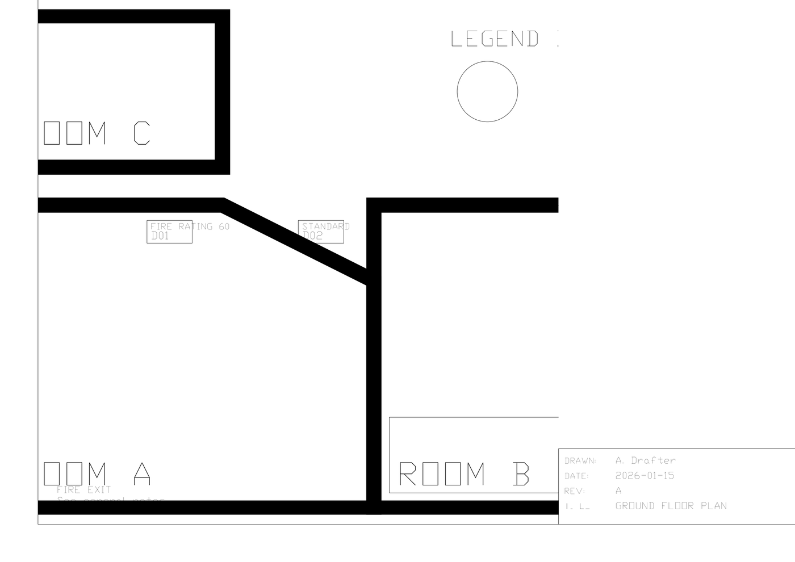
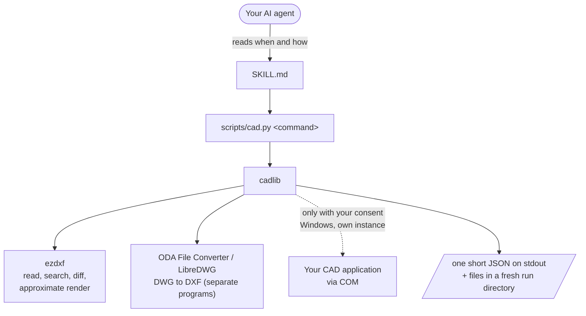

# cad-drawings

**Let your AI agent read, search, compare, convert and render CAD drawings (DWG and DXF) without wrecking your CAD session.**

[](LICENSE)
[](pyproject.toml)
[](https://agentskills.io/specification)
<!-- Add after the first public release: CI status badge, skills.sh badge (https://skills.sh/b/numikel/cad-drawings) -->

```bash
npx skills add numikel/cad-drawings
```

Works on Windows, macOS and Linux. No CAD software needed to read DXF. For DWG you need a converter, or you let the skill use your own AutoCAD on Windows when you say so.



*A render produced by the skill from a synthetic test drawing. Renders made without a CAD plot are approximations and are flagged as such.*

## Quick start

**1. Install** (pick one)

```bash
# Any agent the `skills` installer supports (Claude Code, Codex, Cursor, Copilot, Gemini CLI, ...)
npx skills add numikel/cad-drawings

# Claude Code plugin
/plugin marketplace add numikel/cad-drawings
/plugin install cad-drawings@cad-drawings-skills
```

<details>
<summary>Install by copying the folder</summary>

Copy `skills/cad-drawings` into your agent's skills directory:

| Agent | Folder |
|---|---|
| Claude Code | `~/.claude/skills/` |
| Codex | `~/.agents/skills/` |
| Gemini CLI | `gemini skills install <repo url> --path skills/cad-drawings --consent` |
| Cursor | `~/.cursor/skills/` |
| GitHub Copilot | `~/.copilot/skills/` |

Use one install route: installing the same skill through several routes can leave you with duplicates.

</details>

**2. Check what your machine can do**

```bash
python skills/cad-drawings/scripts/doctor.py
```

`doctor` lists what works now, what is missing and the install command for each missing part. It never installs anything. (Paths in this README are relative to a clone of the repository; an installed skill has the same layout inside your agent's skills folder.)

**3. Ask your agent**

> What changed between `plan_rev1.dwg` and `plan_rev2.dwg`?
> Where does the word "FIRE" appear in `sheet_set.dxf`, and would it print?
> Render every layout of `plan.dwg` so I can look at it.

## What you get

- **Read** DXF directly and DWG through a converter, with the right unit and viewport handling.
- **Search** text, attributes, layer names and block names in every space, including block definitions and frozen layers, and learn whether each hit would land on a printed sheet.
- **Compare** two revisions semantically: a re-save renumbers handles and renames anonymous blocks, and the diff ignores that noise and lists only real changes.
- **Convert** between DWG and DXF through the best available backend.
- **Render** each layout to PNG, with crop and tiles for checking details.
- **Edit** DXF directly or DWG through the CAD application: replace text, change properties, move entities, clone copies, delete, and pan viewports. Every edit is validated in two passes and verified against the original.
- **Plot** deliverable PDFs from the CAD application with control over device, media, scale, rotation, and plot area.
- **Short JSON on stdout** from every command, details in files, meaningful exit codes. Agents never have to parse a wall of text or guess whether a command failed.

## Example

```bash
python skills/cad-drawings/scripts/cad.py diff sheet_set_v1.dxf plan_v2.dxf
```

```json
{
  "status": "ok", "command": "diff", "exit_code": 0, "backend": "ezdxf",
  "summary": {
    "changed": 1, "moved": 1, "removed": 1, "added": 0, "identical": false,
    "noise": { "handles_renumbered": 37, "viewport_ids_changed": 2,
               "anonymous_blocks_renamed": 1, "handseed_changed": 1 },
    "first_changes": [
      "TEXT on layer A-TEXT in model space changed (text: 'STORE' -> 'ARCHIVE')",
      "LWPOLYLINE on layer A-FURN in model space moved by (1500, -750), shape unchanged",
      "CIRCLE on layer A-FURN in model space at [6500.0, 1000.0] has no counterpart in B (cause not determined)"
    ]
  },
  "next": ["added/removed items are unmatched, not explained: confirm with the author"]
}
```

Three real changes found, 37 renumbered handles and four other save artefacts reported as noise, and no claim about *why* the circle disappeared. That last part is deliberate: the skill never invents a reason.

### Edit plan example

Find entities to change:

```bash
python skills/cad-drawings/scripts/cad.py find plan.dxf --pattern "DRAFT"
```

Build and apply an edit plan:

```bash
# edits.json:
{
  "version": 1,
  "base": {"path": "plan.dxf", "sha1": "abc123..."},
  "edits": [
    {
      "id": "status_1",
      "op": "replace-text",
      "handle": "15A",
      "expect": {"type": "TEXT", "text": "DRAFT"},
      "args": {"old": "DRAFT", "new": "FINAL"}
    }
  ]
}

python skills/cad-drawings/scripts/cad.py edit --spec edits.json
```

The edited file (`plan_edited.dxf`) lands in the run directory, verified against the original. The report lists every change; the changeset shows applied edits.

## Why this exists

Agents that work with CAD files tend to fail in the same few ways. We measured a previous, simpler version of this skill before writing this one ([docs/measurements.md](docs/measurements.md)):

- **It left a CAD process running** after every run that used the CAD application (4 of 4).
- **It started your CAD application without asking.** Opening a drawing silently launched AutoCAD, with your licence.
- **It answered from the wrong place.** Search stopped at model space and missed text in layouts, attributes and block definitions.
- **It gave up or half-finished.** One comparison returned nothing after a single rejected call; one update-and-plot task produced one of two PDFs, on the wrong paper size.

This version moves the mechanical rules into code (own CAD instance that cannot outlive the script, retries, fresh run directories, freshness checks) and keeps judgement in the skill text. Numbers come with method and sample size; they show failure modes, not rates.

## Safety: what runs on your machine

- **Your files are never modified.** Every command writes to a fresh run directory. Outputs are written atomically and refuse to overwrite an input.
- **No network, no telemetry in this skill's scripts.** They contain no network code. (The `npx skills` installer has its own anonymous install counter; set `DISABLE_TELEMETRY=1` to turn it off.)
- **CAD only with your consent.** A DWG is read through ODA File Converter or LibreDWG when installed. The skill starts your CAD application only when you agree (`--allow-com`), in its own instance. That process is tied to the script and is terminated if the script dies; a watchdog stops any single call after 90 seconds. Only that one process is ever terminated, never your own session.
- **Nothing is installed without asking.** `doctor` prints commands; you decide.
- **External programs are invoked, not bundled.** ODA File Converter and LibreDWG run as separate programs under their own licences.
- **Windows PDF viewer.** Plotting through AutoCAD can open your default PDF viewer; COM cannot switch that off, so the result carries a warning.

## How it works



## Requirements

- Python 3.10+, `ezdxf` ≥ 1.4.4, `pypdfium2`, `Pillow`, `matplotlib` (and `pywin32` ≥ 312 on Windows for COM). `doctor` checks these.
- For DWG files, one of: ODA File Converter, LibreDWG, or AutoCAD or a compatible CAD with COM on Windows.

| | Windows | macOS | Linux |
|---|---|---|---|
| Read, search, diff DXF | yes | yes | yes |
| Read DWG | converter, or CAD via COM with consent | converter | converter |
| Render preview | approximation, or CAD plot with consent | approximation | approximation |
| Convert DWG ⇄ DXF | converter, or CAD via COM with consent | converter | converter |

Developed and tested on Windows 11 with AutoCAD 2024. The automated tests run on Windows, macOS and Linux in CI. Other CAD applications that expose the same COM interface are detected but untested.

## When not to use it

- **3D models, Revit, SketchUp, BIM.** This is about 2D DWG and DXF drawings.
- **Pixel-exact preview without CAD.** Without a CAD plot, renders are approximate (substitute fonts, no plot styles unless you give a `.ctb`). For deliverable PDFs, use `plot` with the CAD application.
- **A DWG with no converter and no CAD.** The command stops with exit code 3 and tells you the install options.
- **Complex drawing automation.** For sophisticated workflows beyond simple edits and plots, write a script on top of the bundled `cadlib.acad` session library; see [SKILL.md](skills/cad-drawings/SKILL.md).

## FAQ

| Question | Answer |
|---|---|
| Do I need AutoCAD? | No. DXF works with open-source libraries alone. For DWG, install ODA File Converter or LibreDWG, or let the skill use your AutoCAD. |
| Will it change my drawings? | No. Source files are never written. Results go to a new folder. |
| Can it run while I work in AutoCAD? | Yes. It starts its own instance and never touches yours. It is still wise to save your work before agreeing to a CAD run. |
| What are the exit codes? | `0` ok, `1` error, `2` bad arguments, `3` missing dependency or backend, `4` resource busy, `5` timeout, `6` precondition not met, `7` partial success. Every command also says so in its JSON. |
| How do I clean up? | `python skills/cad-drawings/scripts/cad.py cleanup --list`, then `--older-than DAYS --yes`. |

## Documentation

- [SKILL.md](skills/cad-drawings/SKILL.md): what the agent reads
- [references/](skills/cad-drawings/references): COM automation, DXF analysis, backends and installation, visual QA, drafting standards
- [docs/measurements.md](docs/measurements.md): method, baseline and what was fixed
- [cadlib API](skills/cad-drawings/scripts/cadlib/API.md): module contracts
- [CHANGELOG.md](CHANGELOG.md)

## Contributing

Read [AGENTS.md](AGENTS.md) first: the project follows a publication profile (generic content, cross-platform, permissive licences, no client data or vendor files). Run `python tests/check_forbidden.py` and `pytest` before a pull request. Changes to the skill text start with a failing test or measurement.

Found a security problem? Please follow [SECURITY.md](SECURITY.md) instead of opening a public issue.

## Licence and credits

MIT, see [LICENSE](LICENSE) and [THIRD_PARTY_NOTICES.md](THIRD_PARTY_NOTICES.md). Built on [ezdxf](https://github.com/mozman/ezdxf) (MIT) and [pypdfium2](https://github.com/pypdfium2-team/pypdfium2) (Apache-2.0 / BSD-3).

Autodesk, AutoCAD and DWG are trademarks of the Autodesk group of companies. cad-drawings is not affiliated with Autodesk. Other product names are trademarks of their owners. They are used here only to say which file formats and applications the skill works with.
